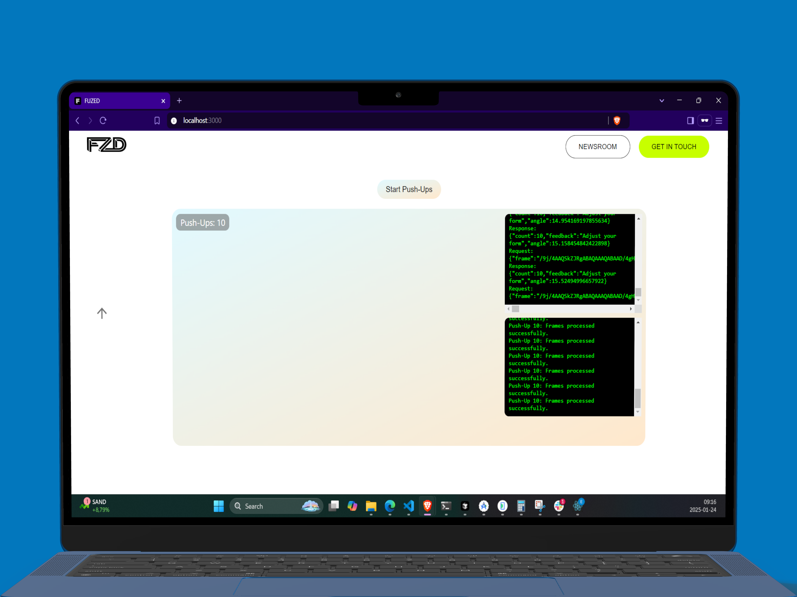
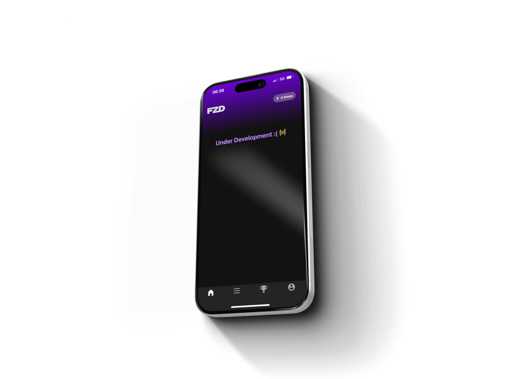
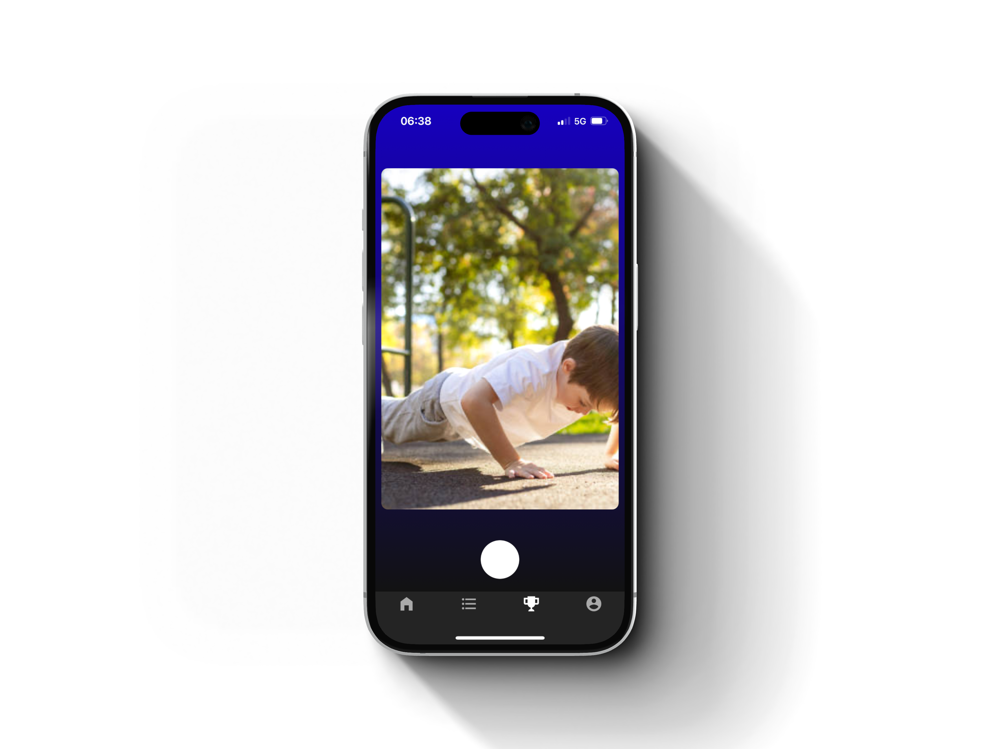
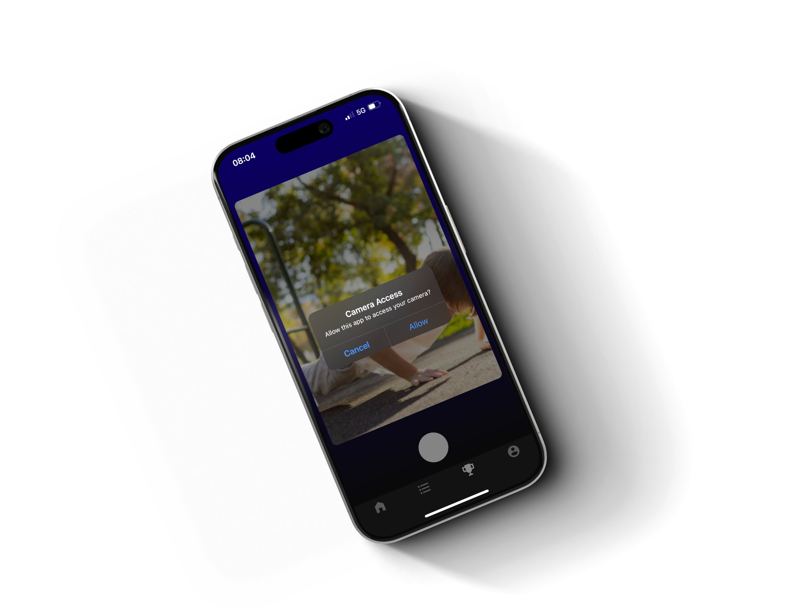

# Fuzed

## About Fuzed
Hey there! So, Fuzed is something I put together using the Expo framework. I’ll be honest, I didn’t focus much on the UI design because most of my energy went into developing and fine-tuning the app’s model. Here are a few things about the project:

- I worked on this using a Windows machine.
- The app needs camera permissions to work properly.
- Since Apple has restrictions on iOS emulators, I couldn’t fully test the iOS version yet.
- I’ve ordered a MacBook so I can transfer the code over and debug it for iOS compatibility.
- In the meantime, I built a web application with ReactJS, using the same backend server, to show how the model works.
- I tested the app on a friend’s MacBook, and it worked great! That’s why I decided to make the switch to a MacBook—it’ll let me develop for both iOS and Android easily.


Here’s a [link to a YouTube video](https://youtu.be/YobP0VaoBE0?si=mjDVPXSZxf_thlnL) where you can see how the web app works.

---

## App Preview
Check out some screenshots from the app:


.png)



---

## How to Run the App Locally
If you want to try it out on your local machine, here’s what you need to do:

1. Clone the repository:
   ```bash
   git clone git@github.com:USBAI/fuzed_app.git
   ```

2. Go into the project folder:
   ```bash
   cd fuzed_app
   ```

3. Make sure you have Expo CLI installed globally. If you don’t, you can install it by running:
   ```bash
   npm install -g expo-cli
   ```

4. Install all the project dependencies:
   ```bash
   npm install
   ```

5. Install the required Expo modules used in the app. These include:
   - `expo-camera` for accessing the device camera.
   - `expo-location` for handling location-based features.
   - `expo-linear-gradient` for gradient effects in the UI.
   - `@react-navigation/native` for navigation within the app.
   - `expo-permissions` to handle permissions for camera and location.
   - `expo-constants` for accessing app constants like manifest details.
   You can install these with:
   ```bash
   npm install expo-camera expo-location expo-linear-gradient @react-navigation/native expo-permissions expo-constants
   ```

6. Start the development server:
   ```bash
   npm start
   ```

7. Use the Expo Go app on your phone to scan the QR code and run the app, or use an emulator (iOS or Android) as guided by Expo CLI.

---

## What’s Next
Once my MacBook arrives, I’m planning to:
- Move the code over to macOS.
- Debug everything and make sure it runs smoothly on iOS.
- Fine-tune the app so it works great on both iOS and Android.

Let me know if you have any questions or feedback!
